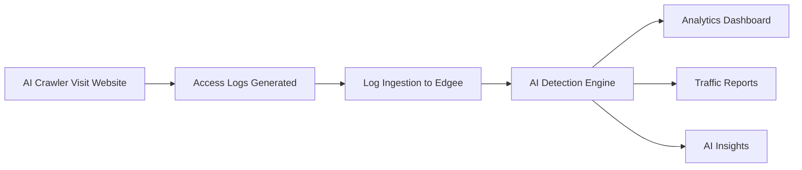

import EdgeeSdk from '/snippets/edgee-sdk.mdx';

<EdgeeSdk />

# AI Analytics Overview

Edgee's AI Analytics helps you understand how AI crawlers (Large Language Model (LLM) and Agents) interact with your website. Gain insights into which AI services are accessing your content, how frequently they visit, and what impact this traffic has on your infrastructure.

## Key Features

### AI Detection & Classification
- **Identification**: Automatically detect and classify AI/LLM from your web traffic
- **Service Recognition**: Identify specific AI services (OpenAI, Anthropic, Google AI, etc.)
- **Traffic Patterns**: Understand when and how often AI systems visit your site

### Traffic Analytics
- **Volume Tracking**: Monitor the volume of AI traffic over time
- **Content Analysis**: See which pages and content AI access most
- **Bandwidth Impact**: Understand the infrastructure cost of AI traffic

### Advanced Insights
- **Crawling Behavior**: Analyze how different AI navigate your site
- **Content Preferences**: Identify what type of content attracts AI crawlers
- **Traffic Impact**: Understand the volume and patterns of AI visits

## How It Works

1. **Log Collection**: Your web server generates access logs from all traffic including AI crawlers
2. **Data Ingestion**: Send these logs to Edgee's analytics endpoint
3. **AI Detection**: Our engine identifies and classifies AI bot traffic
4. **Analysis**: View detailed insights about AI bot behavior on your site

## Getting Started

### 1. Set Up Log Ingestion
Configure your web server to send access logs to Edgee. See our [Log Ingestion Guide](/services/ai-analytics/log-ingestion) for detailed setup instructions.

### 2. Review Your Dashboard
Access your analytics dashboard to see AI bot traffic patterns and insights.

## Use Cases

### Content Strategy
Understand AI preferences to:
- Optimize content for AI training data inclusion
- Identify your most valuable content for AI services
- Track content discovery patterns
- Plan content structure for better AI accessibility

### Infrastructure Planning
Monitor AI bot impact on:
- Bandwidth consumption
- CDN usage and costs
- Traffic volume patterns

### Business Intelligence
Gain insights into:
- Which AI services are using your content
- Traffic trends in the AI space
- Content monetization opportunities
- Competitive analysis of AI activity

### SEO & Discoverability
Optimize for AI discovery by:
- Understanding AI crawler behavior
- Improving content structure for AI consumption
- Tracking content indexing by AI services
- Optimizing robots.txt and crawling policies

## Supported Platforms

Edgee AI Analytics works with any platform that can send HTTP requests:

- **Cloud Providers**: AWS, Google Cloud, Azure, Cloudflare
- **Frameworks**: Express.js, Next.js, Django, Flask, FastAPI
- **Languages**: JavaScript, Python, Go, Java, PHP, Ruby

## Data Privacy & Security

- **Data Encryption**: All data is encrypted in transit and at rest
- **Privacy Compliance**: GDPR and CCPA compliant data handling
- **Data Retention**: Configurable retention policies
- **Access Control**: Role-based access to analytics data

## Next Steps

1. **[Set up Log Ingestion](/services/ai-analytics/log-ingestion)** - Start sending data to Edgee